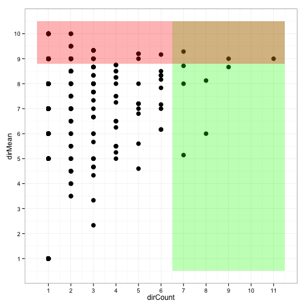
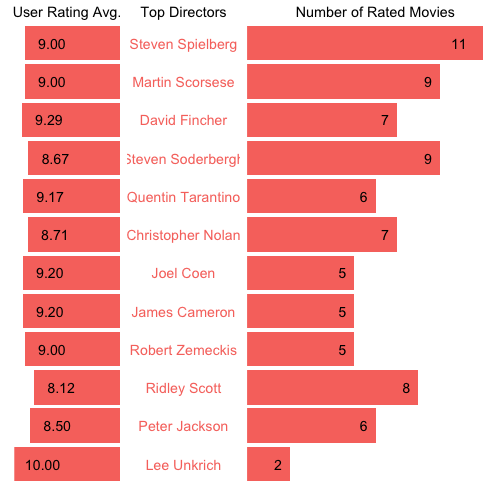

Meet your favorite movie directors
========================================================
author: leo9r   
date: December 20, 2014
transition: rotate

How do we pick our favorite directors?
========================================================

We frequently wonder about our favorite movie 
directors. The following approaches are currenty available to
get to such ranking:

* Trust our instinct, or our memory, by picking the directors 
of the movies we **remember** we have liked the most. 
This approach may lack coherence and systematicity.
* If we rate movies in a website like IMDb, we can rank directors using:
 + Their **average** according to our movie ratings.
 + Their **total** according to how many of their movies we have rated.
* Is there a more satisfactory approach?

Need to combine Average and Total
========================================================
If used isolatedly, A

 

Slide With Plot
========================================================

 
